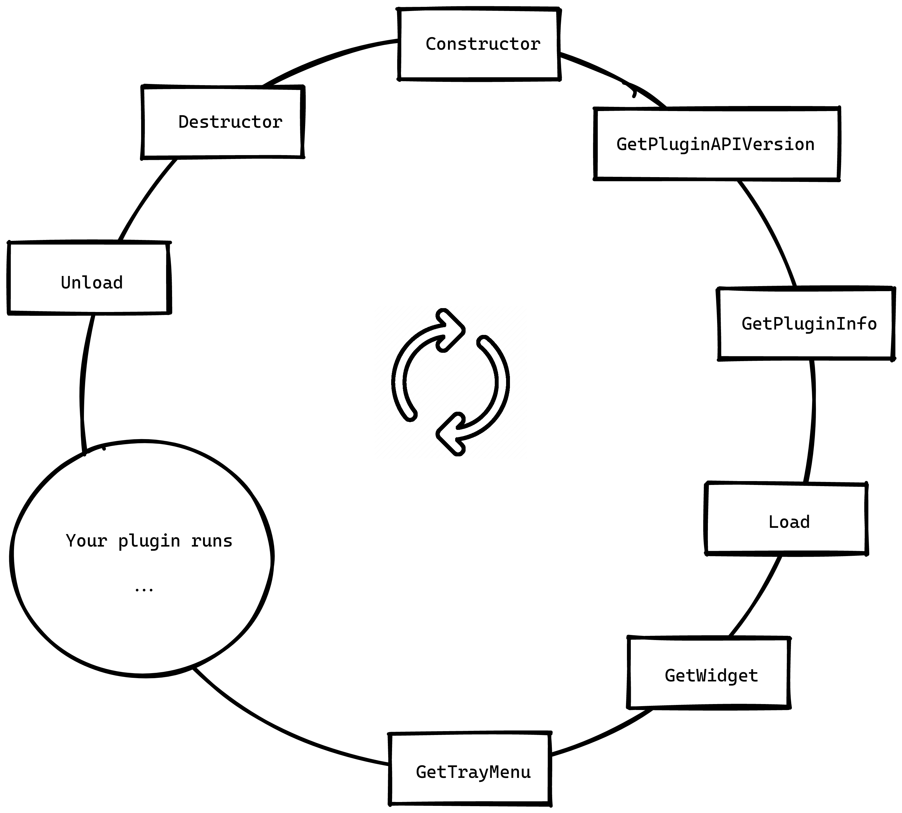

# Contributing

OpenRGB has a plugin system that allows to add some features. This system will give the plugin access to the devices, the profile management and the SDK server.

## Setting up a new project

Clone this repository

```
git clone git@gitlab.com:OpenRGBDevelopers/OpenRGBSamplePlugin.git
```

Rename all occurences of "OpenRGBSamplePlugin" you will find in the code with the name of your plugin. (You are also free to keep the names, it will compile just fine, but im sure you donnt want to!)

Make sure it compiles and try it before you go any further.

## Main concepts

A plugin is basically some c++ code with Qt integration.

There is only one class that your plugin should inherit (OpenRGBPluginInterface), the rest of the plugin code is totally up to you.

A plugin has a life cycle: 

- First, it's loaded and asked for the PLUGIN API version in use. 
- Then, it has to create a widget and a tray menu (optional).
- The plugin is now able to run itself and do some cool stuff (update the leds, load profiles, interact with any other APIs)
- When the user disable the plugin, the Unload method is called, then the destructor is called.



## The plugin interface

```
class OpenRGBPluginInterface
{
public:
    virtual                    ~OpenRGBPluginInterface() {}

    /*-------------------------------------------------------------------------------------------------*\
    | Plugin Information                                                                                |
    \*-------------------------------------------------------------------------------------------------*/
    virtual OpenRGBPluginInfo   GetPluginInfo()                                                     = 0;
    virtual unsigned int        GetPluginAPIVersion()                                               = 0;

    /*-------------------------------------------------------------------------------------------------*\
    | Plugin Functionality                                                                              |
    \*-------------------------------------------------------------------------------------------------*/
    virtual void                Load(bool dark_theme, ResourceManager* resource_manager_ptr)        = 0;
    virtual QWidget*            GetWidget()                                                         = 0;
    virtual QMenu*              GetTrayMenu()                                                       = 0;
    virtual void                Unload()                                                            = 0;
};
```

Your plugin has to inherit this class. Exemple:

```
class MySuperAwesomePlugin : public QObject, public OpenRGBPluginInterface
{
    Q_OBJECT
    Q_PLUGIN_METADATA(IID OpenRGBPluginInterface_IID)
    Q_INTERFACES(OpenRGBPluginInterface)

public:
    ~MySuperAwesomePlugin() {};

    virtual OpenRGBPluginInfo   GetPluginInfo()                                                     override;
    virtual unsigned int        GetPluginAPIVersion()                                               override;
    virtual void                Load(bool dark_theme, ResourceManager* resource_manager_ptr)        override;
    virtual QWidget*            GetWidget()                                                         override;
    virtual QMenu*              GetTrayMenu()                                                       override;
    virtual void                Unload()                                                            override;
    static bool                 DarkTheme;
    static ResourceManager*     RMPointer;
};
```


### Methods:

**GetPluginInfo()**

This method is used to display some basic informations about the plugin, you must return an OpenRGBPluginInfo struct. All fields are mandatory, except `Location`.

```
struct OpenRGBPluginInfo
{
    /*-------------------------------------------------------------------------------------------------*\
    | Plugin Details                                                                                    |
    \*-------------------------------------------------------------------------------------------------*/
    std::string                 Name;           /* Plugin name string                                  */
    std::string                 Description;    /* Plugin description string                           */
    std::string                 Version;        /* Plugin version string                               */
    std::string                 Commit;         /* Plugin commit (git or otherwise) string             */
    std::string                 URL;            /* Plugin project URL string                           */
    QImage                      Icon;           /* Icon image (displayed 64x64)                        */

    /*-------------------------------------------------------------------------------------------------*\
    | Plugin Tab Configuration                                                                          |
    \*-------------------------------------------------------------------------------------------------*/
    unsigned int                Location;       /* Plugin tab location from Plugin Tab Location enum   */
                                                /* This field is mandatory, an invalid value will      */
                                                /* prevent plugin tab from being displayed             */
    std::string                 Label;          /* Plugin tab label string                             */
    std::string                 TabIconString;  /* Plugin tab icon string, leave empty to use custom   */
    QImage                      TabIcon;        /* Custom tab icon image (displayed 16x16)             */
};

```

Exemple:

```
OpenRGBPluginInfo MySuperAwesomePlugin::GetPluginInfo()
{
    OpenRGBPluginInfo info;

    info.Name           = "My super awesome plugin";
    info.Description    = "This plugin will blow your mind";
    info.Version        = VERSION_STRING;
    info.Commit         = GIT_COMMIT_ID;
    info.URL            = "https://gitlab.com/my-user/MySuperAwesomePlugin";

    info.Label          = "Awesome";
    info.Location       = OPENRGB_PLUGIN_LOCATION_TOP;

    info.Icon.load(":/MyResourceImage.png");

    return(info);
}
```

The `Location` field will tell OpenRGB where to place the plugin. The possible values are:

```
OPENRGB_PLUGIN_LOCATION_TOP         = 0,    /* Top-level tab (no icon)                             */
OPENRGB_PLUGIN_LOCATION_DEVICES     = 1,    /* Devices tab                                         */
OPENRGB_PLUGIN_LOCATION_INFORMATION = 2,    /* Information tab                                     */
OPENRGB_PLUGIN_LOCATION_SETTINGS    = 3,    /* Settings tab                                        */
```

**GetPluginAPIVersion()**

This method must return the version of the plugin interface in use, this will allow OpenRGB to know if it can be loaded. The most convenient way is to re-use the one from the OpenRGB submodule:

```
unsigned int MySuperAwesomePlugin::GetPluginAPIVersion()
{
    return(OPENRGB_PLUGIN_API_VERSION);
}
```

**Load()**

This method is called by OpenRGB when the user clicks on "enable" checkbox. You can do some init stuff here.

Exemple:

```
void MySuperAwesomePlugin::Load(bool Dt, ResourceManager *RM)
{
    DarkTheme = Dt; // boolean indicating if the user is using a dark theme
    RMPointer = RM; // A pointer to the resource manager (will provide access to devices, profiles, sdk server, ...)
    
    // Do your init stuff now
    someInitStuff();
}
```

**GetWidget()**

This method is called after Load(). You have to return a QWidget (the root widget if your plugin GUI).

Exemple:

```
QWidget* MySuperAwesomePlugin::GetWidget()
{
    MyWidget* my_widget = new MyWidget(nullptr);
    
    // .... some more stuff maybe
    
    return my_widget;    
}
```

**GetTrayMenu()**

This method is called after GetWidget(). You can return a QMenu that will be loaded in the system tray menu.

Exemple:

```
QMenu* MySuperAwesomePlugin::GetTrayMenu()
{
    QMenu* myMenu = new QMenu("Awesome", nullptr);

    QAction* myAction = new QAction("Do something cool", this);

    connect(myAction, &QAction::triggered, [=](){
        // do something cool
    });

    myMenu->addAction(myAction);

    return(myMenu);
}
```

**Unload()**

This method is called when the user flips off the "enable" checkbox.

Please unload and free anything you can here.


Exemple:

```
void MySuperAwesomePlugin::Unload()
{
    // stop your threads,
    // free some allocated memory,
    // anything that has to be released should be done
}
```

